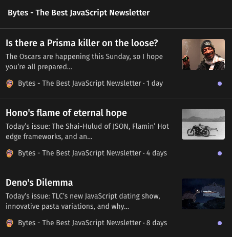

# RSS Tree

[](https://app.netlify.com/sites/rsstree/deploys)
[](https://stats.uptimerobot.com/JRAN7tBD3G)

Generate RSS Feeds from sources that don't have one.

❓ [What's an RSS Feed?](https://ncase.me/rss/)

## Feeds

| Feed | Uptime | Path | Link |
|------|--------|------|------|
| Groww Digest - Daily                   |  | `/.netlify/functions/rss-groww` | [rsstree.netlify.app/.netlify/functions/rss-groww](https://rsstree.netlify.app/.netlify/functions/rss-groww) |
| Bytes - The Best JavaScript Newsletter |  | `/.netlify/functions/rss-bytes` | [rsstree.netlify.app/.netlify/functions/rss-bytes](https://rsstree.netlify.app/.netlify/functions/rss-bytes) |

| Demo images | |
|-|-|
|  |  |

## Development Requirements

- node and npm
- [netlify cli installed globally](https://docs.netlify.com/cli/get-started/)

## Project Scaffolding

Steps:

```
netlify init
netlify functions:create --name <func-name>
```

## Local Development

```
npm install
cp .env.sample .env  # Put all environment variables here
netlify functions:serve
```

### Testing

Automated tests:

```
npm run test
```

Manual tests:

```bash
# when caching with last-modified header
curl 'http://<host>/.netlify/functions/<func>' -Is | grep -i 'last-modified'
curl 'http://<host>/.netlify/functions/<func>' -H 'If-Modified-Since: <last-modified>' -I

# when caching with etag header
curl 'http://<host>/.netlify/functions/<func>' -Is | grep -i 'etag'
curl 'http://<host>/.netlify/functions/<func>' -H 'If-None-Match: "<etag>"' -I
```

### Debugger

Put a `debugger` statement whereever you want it. Then:

Run the debugger with tests:

```
npm run test:debugger
```

Run the debugger when running functions locally:

```
NODE_OPTIONS="--inspect" netlify functions:serve
```
